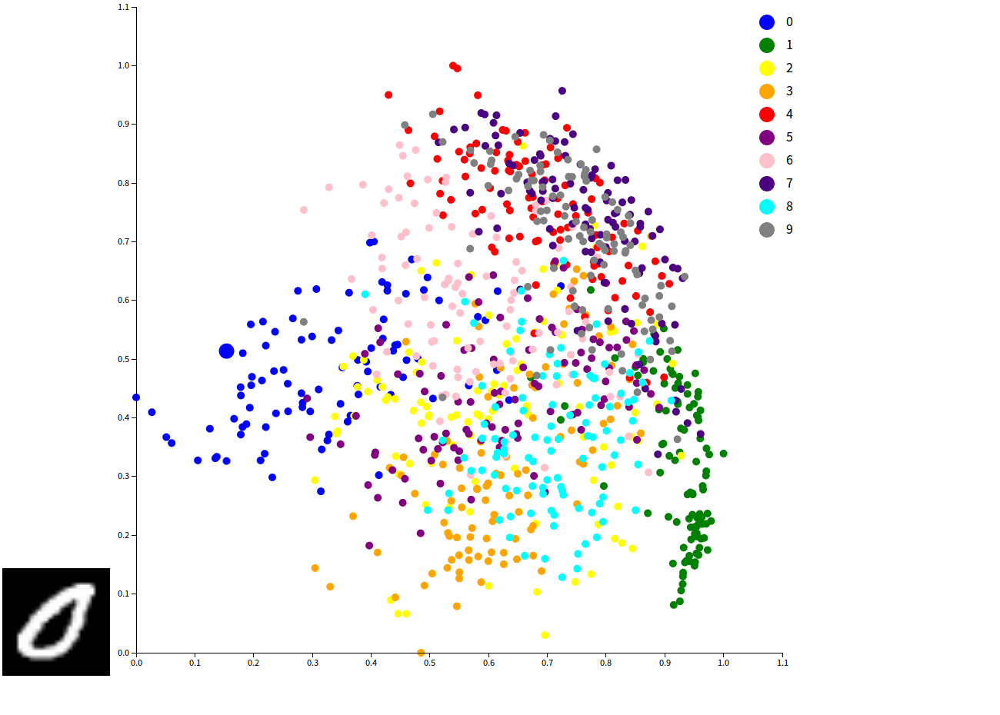

# VisPCA
PCA decomposition visualization project, 
homework for information visualization course, School of Software, Tsinghua University. 
This project utilizes PCA algorithm to decompose randomly sampled 1000 images 
from `MNIST` handwritten digit dataset.
The project realizes a naive implementation of PCA algorithm by `Python`. 
The visualization and interaction is done by `d3.js`. 

## src
- `imgs`: image files generated from `MNIST/sampled_image.npy` by `array_to_image.py`
    - `blank.png`: default blank image without digits
- `MNIST`
    - `sampled_image.npy`: image array in `numpy` serialization format
    - `sampled_label.npy`: label array in `numpy` serialization format

- `array_to_image.py`: generate image files in `imgs` from `MNIST/sampled_image.npy`
- `config.json`: `MNIST` dataset path configuration file for `Python` script
- `data.json`: decomposed data in `json` format for `index.html`

- `index.html`: visualization and interaction by `d3.js`
- `pca.png`: shows visualization effect
- `pca.py`: PCA implementation
- `README.md`: readme

## Python Dependencies

- Pillow 6.2.1
- numpy 1.17.3
- matplotlib 3.0.3

## Instructions

- Run `pca.py` and generate `data.json`
- Run `array_to_image.py` and generate images in `imgs`
- Open `index.html` in browser (perhaps requires localhost HTTP server)
- The circle becomes larger when the mouse passes over, and the image corresponding to the circile appears on the left-bottom

